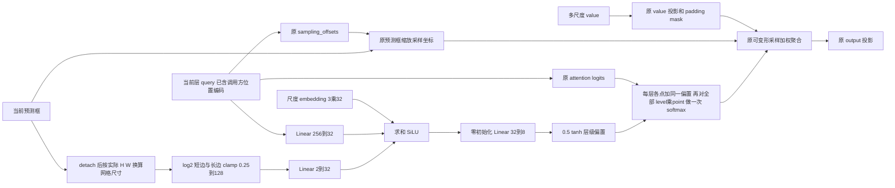

# C21：C2 + SALA

SALA（Short-Axis Level Allocation，短轴感知多尺度可变形注意力）实现为独立的 `SALAMSDeformAttn`。它在完整注意力前向中执行 **query 和预测框网格尺寸条件下的多尺度层级权重修正**。此版本是待验证效果的候选方法，没有正式训练结果或涨点结论。

## 源码和隔离

- 基线：C2 `67c3078e54a657fd96d65fee657a75fbb1dae0d6`。
- 分支：`codex/c21-rtdetr-r18-lite-sala`。
- 本机 worktree：`D:/MyProjects/Crack_RTDETR/outputs/worktrees/sala`。
- 新配置：`ultralytics-main/ultralytics/cfg/models/rt-detr/rtdetr-resnet18-lite-sala.yaml`。
- 正式运行名：`c21_rtdetr_r18_lite_sala_e200_b16_onlineaug`。本机结果目录中 C21 是用户新建的 SALA 任务目录，未发现既有 C21/C22 训练；服务器 `prepare/start` 再检查重名并拒绝覆盖。
- 从原始 C2 创建，未合入 CSCEF/CBR/PDR/TQC/QBD。C17、C19、C20、当前 CBR 诊断和主工作区保持独立。
- 完整阅读的任务文件实际位于 `D:/rtdetr跑结果/c21 SALA/SALA_Codex_Task.md`。本次按明确公式实现，没有读取或导入可选参考模块压缩包。

## 完整模块

外部接口保持 `forward(query, refer_bbox, value, value_shapes, value_mask=None) -> [B,Q,C]`。

投影、采样和聚合沿用仓库的 MSDeformAttn/Deformable-DETR 基础。新增机制是图中的 query、网格尺寸与尺度身份联合决定的 softmax 前偏置。残差、LayerNorm、FFN、self-attention、AIFI、Neck、参考框更新、DN、Hungarian、损失和推理后处理仍在原处。

参考框支持 `[B,Q,1,4]` 和 `[B,Q,3,4]`；描述支路以 FP32 计算 log/clamp，再按线性层 dtype 投影，偏置最终转回 logits dtype。采样支路使用原始未 detach 的框。SALA 明确拒绝二维参考点；默认关闭的原 MSDeformAttn 继续支持二维点。

DecoderLayer 与 RTDETRDecoder 的末尾增加默认关闭的 `sala=False` 参数；注册 `RTDETRDecoderSALA` 选择三个 SALA 实例，沿用原 deepcopy 构建方式。新增初始化恢复 CPU/适用 CUDA RNG；公共键名保持不变。只有 level_head 全零，中间线性层正常初始化，尺度 embedding 使用 std=0.02 正态初始化。

## 实际结构和参数

| 运行位置 | 实际类型 | 完整注意力参数 | 相对 C2 新增 |
|---|---|---:|---:|
| model.26.decoder.layers.0.cross_attn | SALAMSDeformAttn | 214,280 | 8,680 |
| model.26.decoder.layers.1.cross_attn | SALAMSDeformAttn | 214,280 | 8,680 |
| model.26.decoder.layers.2.cross_attn | SALAMSDeformAttn | 214,280 | 8,680 |
| 三层合计 | 三个对象，参数存储不共享 | 642,840 | 26,040 |

原注意力单层 205,600 参数。nc=1 完整模型由 C2 的 20,082,772 增至 20,108,812；nc=80 为 20,210,248。均为未融合模型参数，不表示实测 GFLOPs 或 FPS。

640、batch1 下，每层 query/output 为 `[1,300,256]`，value 为 `[1,8400,256]`，参考框为 `[1,300,1,4]`，实际尺度为 80×80、40×40、20×20。非方形整图及动态 DN 查询数另有验证。

## 受控初始化与验证

统一源权重 SHA256：`fe8501bbcc1d1d5b366bdb10fd47d0fbb91edff1f9558f39e31683a550bcad8e`。初始化脚本检查全部 533 个公共状态键，显式合并后 strict=True 加载；新增 21 个状态键。nc=1 从 nc=80 权重加载时，9 个分类相关状态形状不兼容，由同种子正常构建，逐键比较 C2/SALA，不跨类别错误复制。

本机验证结果见 [C21_LOCAL_VALIDATION.md](C21_LOCAL_VALIDATION.md)，完整逐键审计保存在同目录压缩 JSON。验证包括构造 RNG、真实 train API 重建、CPU/CUDA 输出逐位一致、坐标/权重不变性及有效修改、所有参数 optimizer 分组、真实数据三批更新和 checkpoint 重载。正式初始化、optimizer 与 EMA 不受 smoke 更新影响。

`allocation.jsonl` 每 200 次 attention 调用记录一次各 head 的尺度总质量、delta 分位数、幅度、接近 ±0.5 边界比例。只保留脱离计算图的小统计；不保存每个 query 的完整注意力。日志开关输出和梯度一致性有独立验证。

## 使用与效果边界

全部 109 个训练字段来自已核验 C2 原始 args，仅改变 `model/name/save_dir`，完整差异表由 prepare 保存。200 epochs、batch16、640、seed42、workers8、AdamW、lr0=0.0005、weight_decay=0.0001、warmup5、cos_lr、AMP 与在线增强均保留。

操作见 [C21_AUTODL.md](C21_AUTODL.md)。`prepare` 只准备和执行三批 smoke；正式 200 轮必须手动调用 `start`。

独立 val/test 使用同一 val 选出的 best.pt，并核对 hash、阈值和数据配置。输出 P/R、mAP50、AP75、mAP50–95、native validator 分阶段耗时，以及 GT 轴对齐框短边/长宽比分组的 best-IoU 覆盖统计。后者是独立多对一定位诊断，不称作 AP/检测 recall，也不等同于真实裂缝厚度或方向。尚未运行正式 val/test，未验证精度收益。
