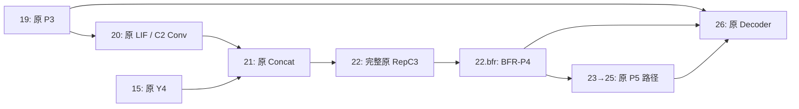

# BFR-P4 v1 实施与交付说明

固定母版：`a0459d6a652cb702699087c88fa39a3e4c4087ec`。独立分支：
`exp-rtdetr-r18-lite-bfr-p4-v1`。此分支只增加 BFR-P4，保留原 CBR、原 LIF-Down 和原 200 轮在线增强配方。
本次正式训练 **NOT_STARTED**，最终 test **NOT_RUN**，没有登录服务器。

## 结构和实验身份

| variant | 配置 | 父结构 | 未融合参数 | 融合后参数 |
|---|---|---|---:|---:|
| cbr_lif_bfr_p4_v1 | rtdetr-resnet18-lite-cbr-lif-bfr-p4-v1.yaml | 原 CBR＋LIF | 20,170,453 | 19,965,653 |
| bfr_p4_v1 | rtdetr-resnet18-lite-bfr-p4-v1.yaml | 原 C2 | 20,103,460 | 19,898,404 |

两配置位于 `ultralytics-main/ultralytics/cfg/models/rt-detr/`。均仅把第 22 层完整 RepC3 输出后接 BFR，
层数仍为 27，内部仍有 3 个 RepConv。继承 RepC3 保留 `model.22.cv1/cv2/m/cv3` 路径，
全部新增可训练状态位于 `model.22.bfr.*`。19 层 P3、23→25 层 P5、Decoder `[19,22,25]` 连接未改。
P4 修正同时供 23 层与 Decoder 使用；共享参数训练后 P3 数值仍可能变化。

## 数学与实现

`Z=GN(W_d(X))`，正交实数 DCT-II 得到 `F`。4 个固定平滑径向频带中心为
`[0,1/3,2/3,1]`、sigma=0.2，逐频率单位分解。统计是每样本、每潜在通道的非 DC 频带能量占比，
分母为该通道全部非 DC 能量加 `1e-6`，按 channel-major 展平为 128。
`128→16→128` SiLU MLP 经 `0.5*tanh` 产生频带系数，混合后强制 DC=0。
直接计算 `R=IDCT(delta_G*F)`，输出 `X+W_o(R)`。

潜在通道为 32、GN 为 4 组。只有 `wo.weight` 全零，两个 Linear bias 和 GN bias 按合同为零；
其余投影/MLP 权重为非零 Xavier uniform，GN weight 为 1。构造只隔离并设定 CPU generator，
保留父模型后续构造 RNG。两变体 BFR 初值逐项相同。

整个新增支路禁用 autocast，用可微函数式算子和原 Parameter 的 `.float()` 视图；出口转换回输入 dtype。
不在 forward 修改 Parameter 或 module dtype。每次以 FP32 重建 DCT 基、频带与 non-DC 常数，
没有持久 buffer、优化器状态或输入缓存，支持矩形、奇数、单轴长度 1。

潜在残差满足近似数值验收 `||R||<=0.5||Z||`、每通道空间均值约为零。
该界不约束可学习 `W_o` 投影后的幅度，也不保证裂缝语义/拓扑、定位或精度收益。
GN.bias 的空间常数贡献只在 DC，因此是数学上的零梯度方向；保留参数及优化器注册。

每变体增加 **20,688** 参数。B1/P4=40×40 的主要 MAC 为 **34,410,496**，
按 2 FLOPs/MAC 为 **0.068820992 GFLOPs**。GN、激活、逐元素统计及基生成不包括在该分析值中。
THOP 使用 BFR 专用 hook 计入函数式投影、DCT/IDCT、MLP；参数单独从真实模型统计。
整网 THOP 明确为 PARTIAL，不能当成完整实测 FLOPs。profiling 仅在副本进行并清除 THOP 临时 buffer。

唯一通用运行修复是 AutoBackend.warmup 的输入从未初始化 `torch.empty` 改成有限 `torch.zeros`。
原 CBR/LIF 源码未改，LF 归一化 SHA256 均核验匹配。

## 受控初始化、配方与数据

源权重仅使用未训练的 `rtdetr_r18_lite_imagenet_backbone_init.pt`，SHA256：
`fe8501bbcc1d1d5b366bdb10fd47d0fbb91edff1f9558f39e31683a550bcad8e`。
初始 checkpoint 为 nc80、epoch=-1；无 optimizer/EMA/scaler 学习状态。
先构建受控父模型，再按 key 精确复制公共状态；真实 RTDETRTrainer.get_model 将 nc80 适配为 nc1。
9 个允许的分类适配张量与同步构造 RNG 的父模型逐值一致。初始保存立刻重载，逐 key 审计。
start 只能用受控初值，resume 只能用同一未完成 run 的原生 checkpoint。

`parent_args.yaml` 来自成功 CBR＋LIF 真实记录，`appendix_args.yaml` 来自本次合同。
`parent_recipe_audit.json` 证明 **109 字段完全一致**；运行 plan 生成逐字段目标差异。
仅模型、输出身份及已核验等价的数据路径可变。epochs=200、patience=50、B16/640、AdamW、
lr0=0.0005、原在线增强、AMP、seed42 等完整快照用于实际 Trainer，不依赖升级后的默认值。

真实数据的 train/val/test 数量为 6048/1728/864，标签框数为 45573/12840/6663。
本机已逐 split 路径清单及标签内容指纹与父记录完全核对，未重划分。
test 仅核对文件清单与标签身份，未进行 test 推理。服务器仍须重验自己的数据副本。

## 本机证据与边界

Python 3.9.25、PyTorch 2.7.1+cu118、CUDA 11.8、RTX 2060 6GB；导入路径指向本独立 worktree。
CPU/CUDA 数学测试使用独立显式 DCT 参考，覆盖正逆、DC、频带分解、能量统计、单频响应、
投影、均值/范数界、样本自适应、RNG、两步梯度及 dtype/checkpoint 生命周期。

两个变体均已检查父/目标输出、同步 RNG/BN/GT/DN 的训练态初值、完整 RepC3 输出的包装接线，
真实 train 图像上的检测 loss、参数覆盖及两次有效更新。整网本机工程 batch 为 B2/160，
单独的 B1/640 推理测时不能替代正式容量验收。
AMP 保留默认 scale=65536，实测 4 次 backoff 后在 scale=4096 完成 2 次有效更新（共 6 batches）。
没有固定 scale=1、没有关闭正式 AMP、没有降低正式 batch。

已学非零 BFR 用于 save/reload、EMA、原生 Trainer 重建与 resume、FP32 fusion、CUDA AMP/half、
AutoBackend 有限 warmup 检查。保存重载按相同 half 量化口径比较。
另在两个变体的 CPU 和 CUDA AMP 已学副本上执行真实 `Trainer.save_model`，验证原生 half EMA、
FP16 optimizer 存储后的重建与 resume，逐项核对保存口径下的模型、optimizer、scaler、EMA 和 epoch。
FP32 默认与临时禁用 TF32 的严格诊断均通过，flags 随后恢复。
低精度融合存在原生 top-k 候选漂移；连续特征和固定候选重放通过，
报告明确区分原生输出与诊断重放，不宣称原生输出完全等价，也未修改正式查询选择。

下列事项仍为 **PENDING**：服务器同一代码/源/初值/数据身份下的 B16/640 原在线增强/native AMP
有限预检、该容量运行的已学 checkpoint 生命周期，以及服务器实际峰值显存/耗时。
启动门要求服务器 preflight=PASSED 且身份完全匹配，局部工程检查不能开启正式 start。
本次没有登录服务器；正式训练 **NOT_STARTED**，最终 test **NOT_RUN**。

## CLI 与交付

- `init_bfr_p4.py`：两个变体初始化及逐 key/Trainer 审计。
- `check_bfr_p4_math.py`、`check_bfr_p4_ops.py`、`check_bfr_p4.py`：数学、参数计算量、本机整网检查。
- `preflight_bfr_p4.py`：服务器有限预算（默认最多 16 batches）的 B16/640 原生 AMP 检查。
- `train_bfr_p4.py plan|start|resume|status`：分离计划/启动/恢复/状态，拒绝覆盖已有 run 或自动 name2。
- `eval_bfr_p4.py val|test`：固定同一 val-selected best.pt SHA，先独立 val 后 test。
- `pack_bfr_p4_light.py`：轻量证据包，不触发训练/评估，排除权重、数据、大预测和参考包。

评估保留 `corrected_sorted_conf_mask_v1`：先排序再按已排序置信度过滤，不加 NMS，
imgsz640、batch16、workers0、half=False、conf0.001、iou0.7、max_det300、augment=False、rect=False、seed42。
输出完整精度 P/R/AP50/AP75/mAP50–95、逐 IoU AP、速度、PR/混淆矩阵等。
既有实验的 test 结果已被看过；本候选按 val 筛选，不用本次 test 调参。

`SERVER_COMMANDS.template.md` 是版本化模板。提交完成后才生成独立交付目录中的 `SERVER_COMMANDS.md`，
填入最终完整 40 位 SHA，避免文档 SHA 自指循环。以该固定副本的第 1 段作为下一条服务器操作。
本机报告、代码绑定、远端 SHA 验证、增量 bundle 及其一次性仓库导入验证也在独立交付目录。

## 参考来源与研究限制

指定 `dc2eda42-6ea1-467d-ab90-02d26882d4d0.zip` 在项目、附件和 Downloads 的有界查找中未找到，
状态记为 PENDING（`reference_package.json`）；未声称读取其中 Heat2D/MultiFrequencyChannelAttention/DynamicFilter。
按用户提供的精确数学合同实现，没有执行参考包代码或整体替换 ultralytics。

背景来源：[vHeat](https://arxiv.org/abs/2405.16555)、[FcaNet](https://arxiv.org/abs/2012.11879)、
[FFT-based Dynamic Token Mixer](https://arxiv.org/abs/2303.03932)。只作为相关技术背景，
不能证明 BFR 有效或首创。本次工程通过不意味着已涨点；不预设高频等于裂缝或低频等于背景。
