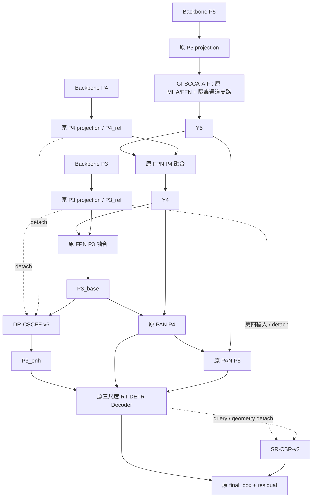

# Decoupled Reference Triad v1

本分支从 C2 `67c3078e54a657fd96d65fee657a75fbb1dae0d6` 建立。先完成 [兼容性审计](compatibility_audit.md)，再迁入原 C17/C19/C24 必要模块并实现新类。没有继承 C24 分支上的 ACR，也没有改 loss、matcher、DN、query 数、Backbone、原 FPN/PAN 或正式配方。

CSCEF 在 PAN 完成后执行。图中 P3_enh 没有返回 PAN 的边。第四个 Decoder 输入只给 CBR，原 `_get_encoder_input()` 仍只接收三尺度。主模型仍完整训练，reference 仅在创新分支内 detach；“稳定”指不被其他创新模块直接改写，并不意味着 Backbone 在训练过程中被冻结。

## DR-CSCEF-v6

`DRCSCEFv6(CSCEFv51)` 保留 C17 的 hidden=32、groups=8、eps=1e-6、5 个无 bias 卷积、无 affine GroupNorm、SiLU、Scharr/32、reflect/replicate 边界、FP32 coherence/reliability、完整非线性置信度的逐图 H/W 均值及零输出投影。继续沿用 C17 的语义输入先插值再投影/归一化顺序，不另造融合内核。输入改为 `[P3_base, P3_ref, P4_ref]`；两个 ref 的内容分支 detach，结果为 `P3_base + delta`。新增 26,912 参数。

## GI-SCCA-v2

`GISCCAAIFI(SCCAAIFI)` 只将 `scca_channel(x,s)` 的 x/s detach。256→64、4×16 通道关系、Q 来自 MHA 输出、K/V 来自输入、无 affine LN、Q/K 沿 token 去均值与归一化、有界温度、FP32 数值核心、pre/post-norm 注入点均不变。非零同参数 v1/v2 forward 完全相同。新增 65,540 参数。

## SR-CBR-v2

`StableReferenceCBR(CrackBoundaryRefinement)` 保留 36 固定采样点、4 边×3 沿边位置×内/边/外、signed inside-outside evidence、query 非线性条件、side embedding、geometry projection、border padding、align_corners=False、零 offset_out 和原 xywh 残差公式。正式固定 rho=.075，normal_fraction=.10。

稳定 P3_ref、query、geometry 及位移尺度 w/h 均 detach；`original=boxes.float()` 不 detach。每边位移有界于原宽/高的 7.5%，宽/高比例位于 [0.85,1.15]。原 C19 的 w/h 位移尺度仍有梯度，这是审计确认并在 v2 隔离的一条条件路径。新增 45,889 参数。

`RTDETRDecoderCBRv2` 检查四输入、P3 reference 尺寸、核心尺度顺序及原最终 eval_idx。仅最终返回层的 box 被替换一次，早期层、encoder 输出和参考框迭代不变；DN 查询按实际数量动态处理。

## 语义映射及边界

`tools/triad_compat.py` 从原 Backbone Blocks 的 stage 和真实 projection 边查找 P3/P4 reference，从原 Decoder 输入查找 PAN 输出。逐节点核对公共操作、参数和依赖边，再生成公共 state 的精确对应。工具不依赖固定 19/22/25 等语义层号。YAML 中的数字是序列化后的真实连接。

仅 `modules/__init__.py`、`tasks.py` 的明确类分支与 `transformer.py` 的可选 `return_final_query=False` 接口有公共代码改动。原 head.py、trainer、训练验证器、loss、matcher/DN 文件和 C2 YAML 保持 C2 原值。旧 CSCEFv51 / SCCAAIFI / RTDETRDecoderCBR 原类与 YAML 保留用于回归。

梯度隔离不消除所有组合交互：SCCA 仍改变原主路，三模块仍共享下游检测损失，CBR 条件值仍随 query/box 更新。新的结构是否形成单模块→双模块→三模块增益，必须由后续正式训练验证。
